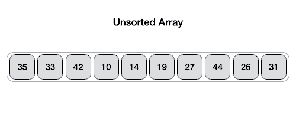

# QuickSortMultiThreading
Parallel programming quick sort and parallel sum examples with Fork-join, RecursiveTask&lt;T>, RecursiveAction

# Fork-Join

Fork-Join in Java is used to make use of the cores (brain of CPU that process the instructions) in an efficient manner. The fork/join splits a bigger task into smaller sub-tasks. These sub-tasks are then distributed among the cores. The results of these subtasks are then joined to generate the final result. The splitting of a task and joining the results imitates the divide-and-conquer algorithm. The fork is responsible for splitting the task, and join is responsible for merging the results of the task to generate the final result.
  
It is worth noting here that various threads that are responsible for the completion of the sub-tasks never sit idle. In fact, they implement the work-stealing algorithm, where an idle thread steals the work from those threads that are busy.

### Fork-Join pseudocode

``` java
if (my portion of the work is small enough)
  do the work directly
else
  split my work into two pieces
  invoke the two pieces and wait for the results
```

# QuickSort Algorithm

QuickSort is a Divide and Conquer algorithm. It picks an element as pivot and partitions the given array around the picked pivot. There are many different versions of quickSort that pick pivot in different ways.



### QuickSort Algorithm Pseudocode

``` java
quickSort(arr, beg, end)
  if (beg < end)
    pivotIndex = partition(arr,beg, end)
    quickSort(arr, beg, pivotIndex)
    quickSort(arr, pivotIndex + 1, end)

partition(arr, beg, end)
  set end as pivotIndex
  pIndex = beg - 1
  for i = beg to end-1
  if arr[i] < pivot
    swap arr[i] and arr[pIndex]
    pIndex++
  swap pivot and arr[pIndex+1]
return pIndex + 1
```


#### Resources
https://www.geeksforgeeks.org/quick-sort-using-multi-threading/  
https://www.baeldung.com/java-fork-join  
https://www.tutorialspoint.com/java_concurrency/concurrency_fork_join.htm  
https://docs.oracle.com/javase/tutorial/essential/concurrency/forkjoin.html  
https://www.javatpoint.com/fork-join-in-java
